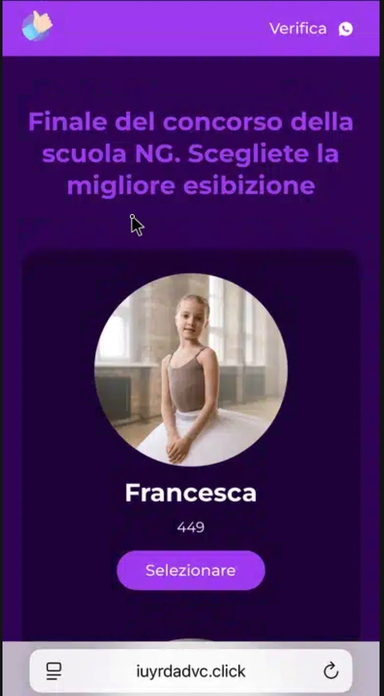
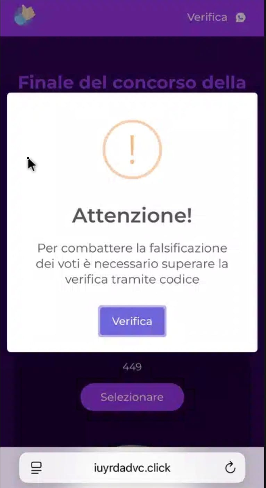
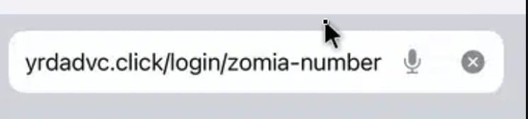
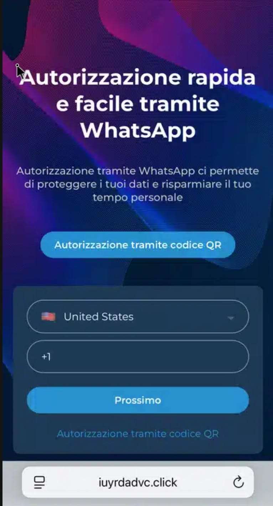

# SOC Incident Report: WhatsApp Session Hijacking (QRLJacking)

- Report ID: IR-20260324-01
- Date: March 24, 2026 [next occurences yyyy-mm-dd]
- Analyst: b4gel
- Severity: Critical (Account Takeover)
- Status: Closed / Documented

--- 

# 1. Executive Summary

On March 24, 2026, a phishing campaign was identified targeting Italian WhatsApp users via a "Social Voting" lure. The attack utilizes a sophisticated phishing kit hosted on the domain `iuyrdadvc[.]click`. The objective is to hijack active user sessions by abusing the "Linked Devices" feature, bypassing traditional Multi-Factor Authentication (MFA).

# 2. Incident Details

- Source: Compromised WhatsApp Account (Peer-to-Peer)

- Lure: "Ciao, potresti votare per Francesca? È la figlia dei miei amici, il primo premio è un corso gratuito di danza, ed è molto importante per lei!"

- Observed URL: `hxxps[://]iuyrdadvc[.]click/home/voteеtor`

- Destination IP: `104[.]21[.]52[.]156`

- Target Domain: iuyrdadvc[.]click

- Infrastructure: Cloudflare (utilizing Evasion/Cloaking).

- Creation Date: 2026-03-24 (Same-day registration).

- Targeting: Italian WhatsApp users. (Website is in italian even through VPN and Browserling)

# 3. Technical Analysis

## 3.1 Anti-Analysis & Cloaking

Initial reconnaissance using standard CLI tools (curl; even with various User-Agent strings) and automated sandboxes (urlscan) resulted in 404 Not Found and 429 Too Many Requests errors. No malicious flagging (VirusTotal).

Observation: The attacker employs Environment Keying. Needs further investigation on how the fingerprinting is achieved.

Bypass: Successful detonation was achieved using a cloud-based browser emulator (Browserling), confirming the site only serves malicious content to matching signatures. (Android 15, iOS 18, Windows 10 tested)

## 3.2 Attack Vector: QRLJacking / GhostPairing

The site presents a landing page in Italian: "Finale del concorso della scuola NG. Scegliete la migliore esibizione" with images of two female chilrens

After you select one: "Per combattere la falsificazione dei voti è necessario superare la verifica tramite codice."

And continuing redirects to `/login/zomia-number`

The site offers two exploitation paths:

QR Code Injection: The site displays a QR code that is a real-time proxy of a WhatsApp Web pairing code.

Phone Number Pairing: The site requests the victim's phone number and displays a 6-digit code.

_Mechanism_: This is an Adversary-in-the-Middle (AitM) attack. The phishing kit acts as a bridge between the victim and the legitimate WhatsApp servers. Once the victim enters the code or scans the QR, the attacker's server captures the `session_id` and `secret tokens`, granting persistent access to the account.

# 4. Indicators of Compromise (IoCs)

| Type       | Value              | Notes                        |
| ---------- | ------------------ | ---------------------------- |
| Domain     | iuyrdadvc[.]click    | Phishing Landing Page        | 
| IP Address | 104[.]21[.]52[.]156      | Cloudflare Edge IP           |
| Tactic     | Social Engineering | "Dancing opportunity voting" |

# 5. Remediation & Recommendations

## 5.1 Immediate Victim Response
- Revoke Sessions: Navigate to `WhatsApp > Settings > Linked Devices` and revoke access ("Log out") of all sessions. Then re-establish a safe session.

## 5.2 Organizational Defence
- DNS Blocking: Blacklist `*.click` domains registered within the last 24 hours.
- User Training: Educate users to never use QR codes and other pairing methods with 3rd-party websites.

# 6. Lessons Learned
- Cloaking Awareness: Simple User-Agent obfuscation is easily defeated.

- OPSEC: Initial recon was performed from a non-attributed IP address. Future investigations should utilize dedicated VPNs/Dirty Lines to prevent analyst IP exposure to the adversary's logs.

